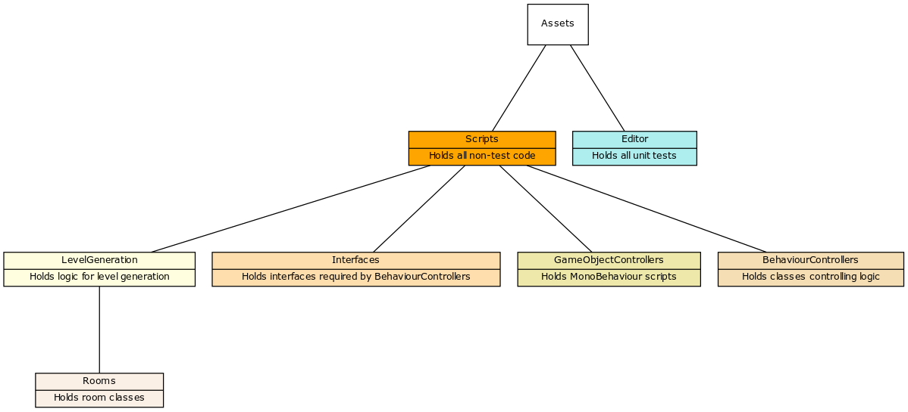
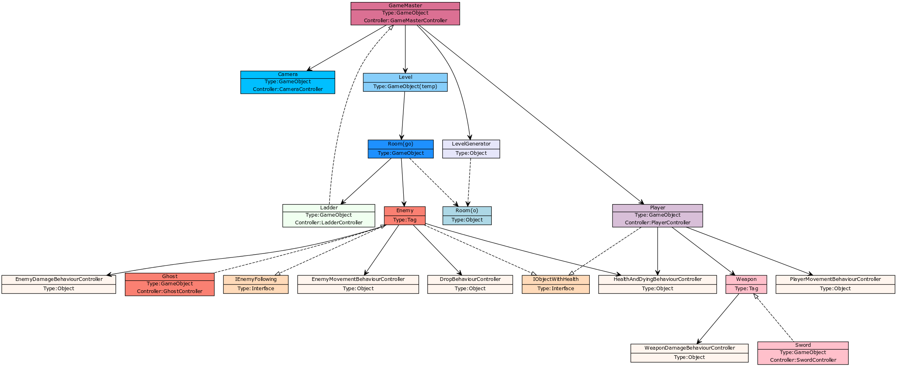
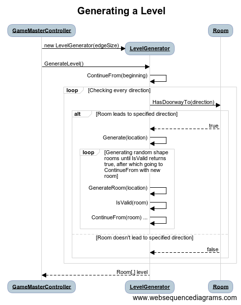

# Arkkitehtuurikuvaus

## Yleiskuva

Sovellus koostuu kolmesta eri tasosta:
Korkean tason **GameObject**-olioista, joita luodaan ja käsitellään Unityn sisällä,
**MonoBehaviour**-skripteistä, eli luokista jotka kontrolloivat GameObjecteja suoraan,
ja perinteisistä **luokista**, jotka suorittavat sovelluslogiikkaa.

Tämä rakenne on helposti testattava:
Koska GameObjectit ja niitä ohjaavat MonoBehaviour-skriptit hoitavat UI-puolen ja näin kaikki riippuvuuksia vaativat toimet, sovelluslogiikkaa käsitteleville luokille on helppo kirjoittaa kattavat yksikkötestit.
Käytössä on lisäksi **rajapintoja**:
Kun on tärkeää, että logiikkaa käsittelevä luokka pääsee ohjaamaan jotain osaa GameObjectin käyttäytymisestä, sen GameObjektin MonoBehaviour-kontrollerin tulee implementoida jokin luomani rajapinta, ja näin logiikkaluokka on riippuvainen vain rajapinnasta, eikä MonoBehaviour-skriptistä, joita on käytännössä mahdoton mockata.

## Pakkausrakenne

Sovelluksen pakkausrakenne noudattaa Unityn standardia:
Assets-kansio sisältää kaikki sovelluksen resurssit, mukaan lukien koodin Scripts-kansiossa ja yksikkötestit Editor-kansiossa.

Pakkausrakennetta kuvaava kaavio:

## Tiedostot

Allaolevassa, jonkin verran yksinkertaistetussa luokkakaaviossa on Unityn sisällä luotavat GameObject-oliot on merkitty GameObject-tyyppisiksi, ja niitä ohjaavat MonoBehaviour-skriptit niiden ohjaimiksi (controllers).
Object-tyyppiset oliot vastaavat sovelluslogiikasta, koska ne luodaan koodissa käsin konstruktoria käyttäen.
Ne sijaitsevat kaikki BehaviourControllers-paketissa, ja ovat nimetty tyyliin 'XxBehaviourController'.

Tag-tyyppiset oliot viittaavat Unityn tag-systeemiin.
Näin GameObjectit voivat omalla tavallaan toteuttaa perintää: Esimerkiksi Ghost-oliolla on tagi Enemy, jolloin muut GameObjectit ja niiden kontrollerit voivat tunnistaa, että kyseinen GameObject on Enemy.
Enemy ei kuitenkaan ole itse mikään olio tai luokka.

## Tasojen generointi

Sovelluksen koodin kannalta monimutkaisin ja työläin osa on tasogenerointi.

Pelin tasot ovat proseduraalisesti generoituja.
Allaoleva sekvenssikaavio kuvaa tason generoimista.
Algoritmi on rekursiivinen.
Jokaisen luodun huoneen jokainen oviaukko tutkitaan:
Jos oviaukko ei vielä vie huoneeseen, avataan uusi haara, jossa oven taakse generoidaan ja kokeillaan erilaisia huoneita.

